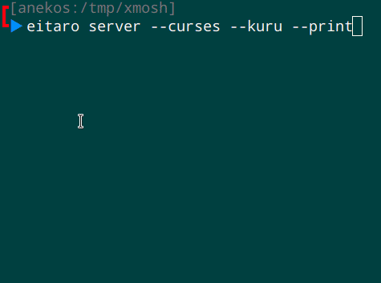

[](https://travis-ci.org/anekos/eitaro)


# えいたろ

CLI の [英辞郎のテキストデータ](https://booth.pm/ja/items/777563) 用の辞書アプリです。


# Installation

各 OS 用の `cargo` をインストールして

```
$ cargo install --git 'https://github.com/anekos/eitaro'
```

とします。

`~/.cargo/bin/eitaro` が作成されるので、alias を貼るかパスを通します。


# Usage

## 辞書を構築する

[英辞郎のテキストデータ](https://booth.pm/ja/items/777563) の zip を解凍して、そのデータから辞書を構築します。

```
eitaro build ~/dictionary/EIJIRO-1445.TXT
Building...
Reading...
Encoding...
Loading...
```

これは最初に一度だけ行うだけです。
一般的には `~/.cache/eitaro/dictionary` に作成されると思います。


## 普通に単語を引く

```
$ eitaro lookup chrysoberyl
名 金緑石、クリソベリル
...
```

`lookup` は `l` と省略できます。


## 対話シェル

無引数で起動すると対話型になります。

```
$ eitaro
Eitaro> chrysoberyl
名 金緑石、クリソベリル
...
Eitaro> cat
名 かわいい生物
...
```

## HTTP サーバ

辞書を引いた結果を返すだけの単純なものです。

```
$ eitaro server 127.0.0.0:8116
```

`127.0.0.1:8116` は省略できます。


外部からリクエストを送り、コマンドラインに表示するために、`-p` で引かれた結果を出力もできます。
`-c` フラグも付けて Curses を使うのが見やすくてオススメです。

```
$ eitaro server -p -c 127.0.0.0:8116
```


# Vim 連携

上記の HTTP サーバ機能と連携すると Vim のカーソル下の単語を自動で引けます。
`.vimrc` に↓のように書くだけです。
CursorHold をイベントを使っているので、一定時間キーが押されなかったときに自動で引かれます。

```
function! s:eitaro()
  silent! call system('curl --silent http://localhost:8116/word/' . expand('<cword>'))
endfunction

augroup eitaro
  autocmd!
  autocmd CursorHold * call s:eitaro()
augroup END
```


# webext

`webext` 以下は Firefox 用のアドオンです。
HTTP サーバ機能との連携で Firefox のカーソル下のテキスト(あるいは選択テキスト)を自動で引けます。


# シューティング機能

HTTP サーバで `--kuru` フラグを有効にすると、自機が出現し、スペースキーで文字を撃つことができます。

```
$ eitaro server --kuru
```




# 辞書構築仕様

単純な単語の登録だけでなく、以下をエイリアスとして認識します。
なので、不規則変化形でも検索できます。

- 変化形
- 参照表記
- カタカナ発音

**カタカナ発音**は、あくまでも発音ということのようで、日本語での一般的な表記とは異なることも多いようです。


# 検索仕様

検索語は自動的に以下の変換が行われます。
これは、辞書の構築の際にも行なわれます。

- 全角(Full width)から半角(Half width)
- `ー` を除去
- 小文字化
- 前後の空白の除去


また見つからない場合、自動的に以下の変換などを行なって再検索します。

- 文字ケースの修正 (`snake_case → snake case` `camelCase → camel case`)
- 区切り文字のスペース化 (`foo-bar → foo bar`)
- 後続単語を(一つずつ)削除 (`foo bar baz → foo bar → foo`)
- 単語毎に分解し、長いものからリストアップ
